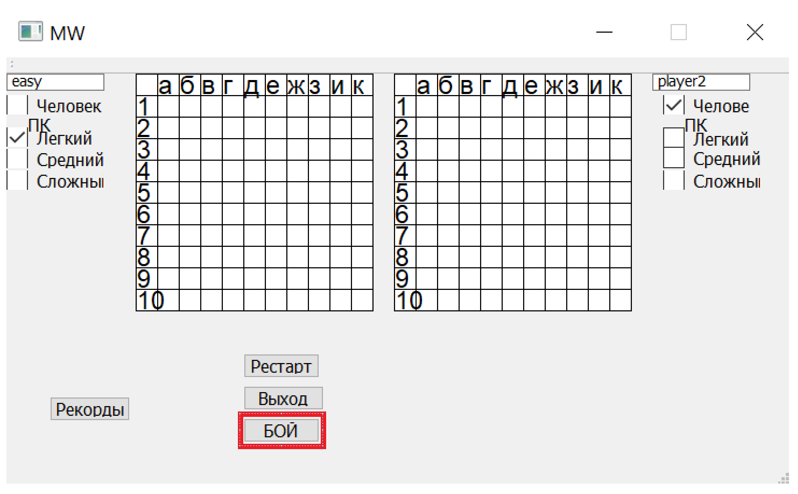

# SeaBoysBattleFoundationOfCorporation
Программа для локальной игры в морской бой с компьютером или другими игроками, но не более 2.
### Органны управления
1. Логины участников или компьютера

3. Выставление сложности искуственного интелекта или выбор участников

4. начало игры

5. сброс игровых настроек и игры 

6. рекордв прошлых и нынешних участников

7. выход из игры

## О проекте
Проект написан на й версии QT 5.14.12. Для написания проекта использовали следующие материалы [документацию](https://doc.qt.io/qt-5/gettingstarted.html),
[Руссие Блоги](https://russianblogs.com/article/9448531598/),[Qt 5.10. Профессиональное программирование на С++. М. Шлее](https://codernet.ru/books/c_plus/professionalnoe_programmirovanie_na_c_m_shlee/).

### Участники:
##### Автамонов Андрей БИБ 215 1 курс информационной безопасности
###### при поддержке - семинарист (курс Алгоритмизация и программирование) - Георгий Сергеевич Байдин
